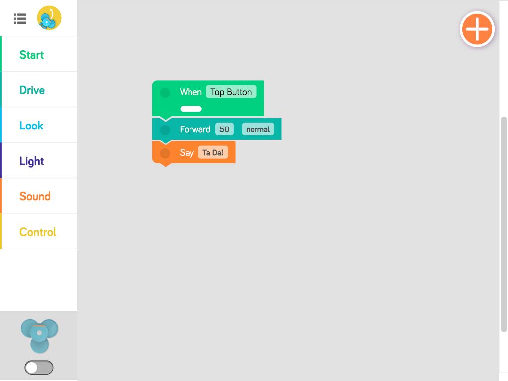
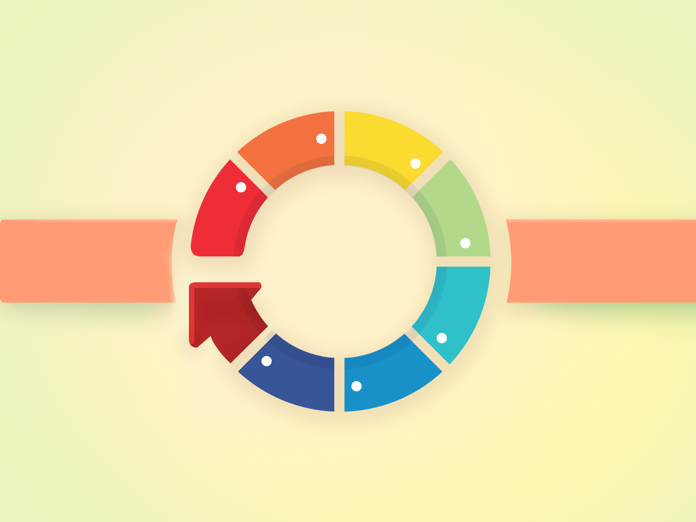

<!------------------------------------------------------------>
<!-- Topic: xxx -->

<h2>Kizer Kids Coding!!!</h2>

Car Parts!   <small>https://www.khanacademy.org/computer-programming/car-parts/5246084714135552</small> 

Make a new project   <small>https://www.khanacademy.org/computer-programming/new/pjs</small> 
Learn more!!!   <small>https://www.khanacademy.org/computing/computer-programming/programming</small>

<!------------------------------------------------------------>
--SLIDE--
<!-- Topic: Code -->

<h2><b>Code</b> basics</h2>

--SUBSLIDE--

<h2>Variables</h2>

--SUBSLIDE--

<pre><code>
>>> x = 1
>>> x
1
>>> y = 2
>>> y
2
>>> x + y
3
>>> x = 10
>>> x + y
12
</code></pre>

--SUBSLIDE--

<h2><b>Input</b> and <b>Output</b></h2>

--SUBSLIDE--

--SUBSLIDE--

--SUBSLIDE--

<h2><b>If</b></h2>

--SUBSLIDE--

--SUBSLIDE--

<h2><b>Loops</b></h2>

--SUBSLIDE--

--SUBSLIDE--

--SUBSLIDE--

<h2><b>Functions</b></h2>

<h3>Give a name to blocks of code...</h3>

--SUBSLIDE--

<h2><b>Use over and over...</b></h2>

<!------------------------------------------------------------>
--SLIDE--
<!-- Topic: Languages -->

<h2>We are using Javascript</h2> 
<h2><b>Syntax Matters!!!!</b></h2>

<pre><code>
ellipse(100,200,50,50);
</code></pre>

--SUBSLIDE--

<pre><code>
if (mouseIsPressed) {
    playSound(getSound("rpg/giant-no"));
}
</code></pre>

--SUBSLIDE--

<h2>Documentation</h2>

--SUBSLIDE--

<!------------------------------------------------------------>
--SLIDE--
<!-- Topic: Example -->

<h2><a href="https://www.khanacademy.org/computer-programming/car-animate/4737555586678784">Car Animate</a></h2>

<!------------------------------------------------------------>
--SLIDE--
<!-- Topic: Example -->

Car Parts!   <small>https://www.khanacademy.org/computer-programming/car-parts/5246084714135552</small> 
Car Basic!   <small>https://www.khanacademy.org/computer-programming/car-basic/6301677851836416</small> 
Car Animate!   <small>https://www.khanacademy.org/computer-programming/car-animate/4737555586678784</small> 
Chess!   <small>https://www.khanacademy.org/computer-programming/chess-board/5216344716410880</small> 
